# Finance Hub

<p align="center">
  
  
  
  
  
  
  
</p>

A self-hosted personal finance dashboard built for Swiss household finances. Track every account, model budget scenarios, follow your portfolio month by month, manage subscriptions and taxes, and get AI-powered advice — all from a single app running on your own hardware.

https://renehungerbuehler.github.io/finance_hub/

---

## What it does

Enter your accounts, build one or more budget scenarios (salary, side income, different expense configurations), and the app keeps everything in sync. Change a scenario and the dashboard updates. Record a monthly balance and the tracker plots your path. The AI advisor has your full financial context — accounts, active scenario, tax history, insurance, everything — so it can answer real questions about your specific numbers.

**Built for Swiss residents:**
- Models the official 3-pillar pension system (AHV, BVG, Pillar 3a) plus 2 personal wealth-building pillars
- Tracks Swiss tax types (Staats-/Gemeinde + Bundessteuer × Provisorisch/Schlussrechnung) with paid dates and multi-year history
- Calculates financial freedom targets using the 4% rule adjusted for Swiss Vermögenssteuer
- AI advisor understands BVG buy-in (Einkauf), Pillar 3a max (CHF 7'258/yr), Krankenkasse franchise optimisation, and Swiss capital gains exemption
- CHF-native, `de-CH` locale formatting

**Privacy-first:** runs fully self-hosted on your own hardware — no data leaves your machine except for AI queries sent to your chosen AI provider (Anthropic, OpenAI, or Gemini).

---

## Screenshots

### Dashboard
Net worth overview with liquid/locked breakdown, survival runway, monthly cashflow chart, and portfolio allocation donut.

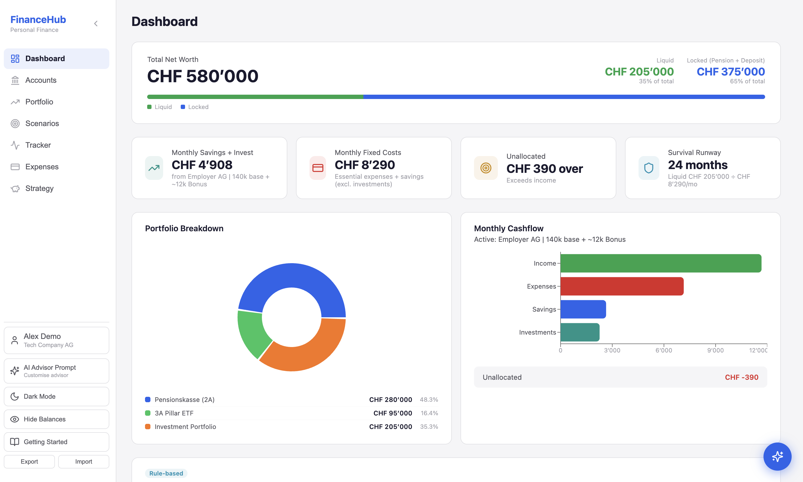

### Accounts
All portfolio accounts — investments, Pillar 2A and 3A — with balances, types, and institutions. Inline-editable, sortable, grouped total.

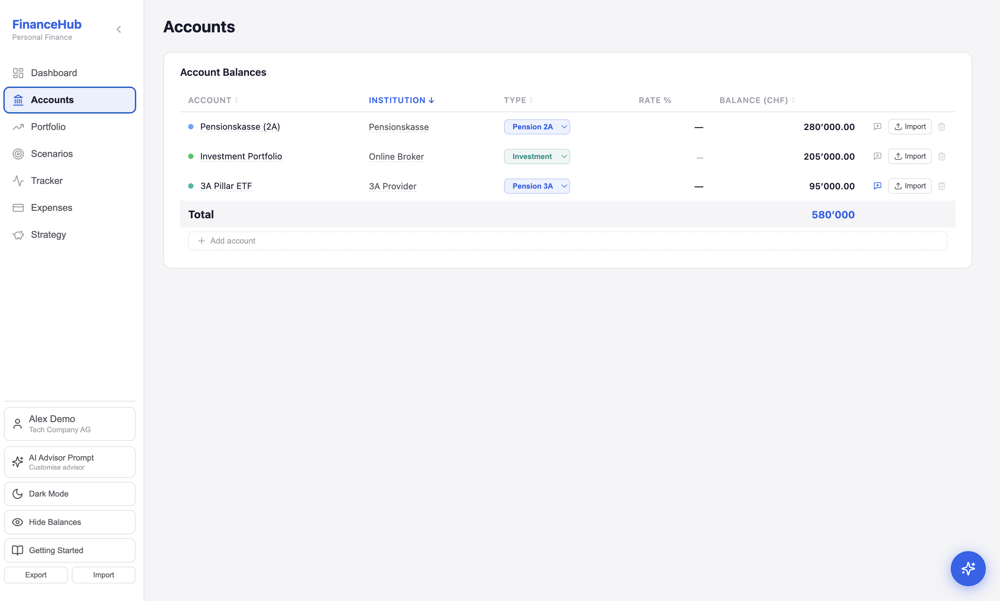

### Portfolio
Live positions view with real-time prices (Yahoo Finance), cost basis, current value, P&L per position and overall. Expandable per account, manual entry support, allocation chart.

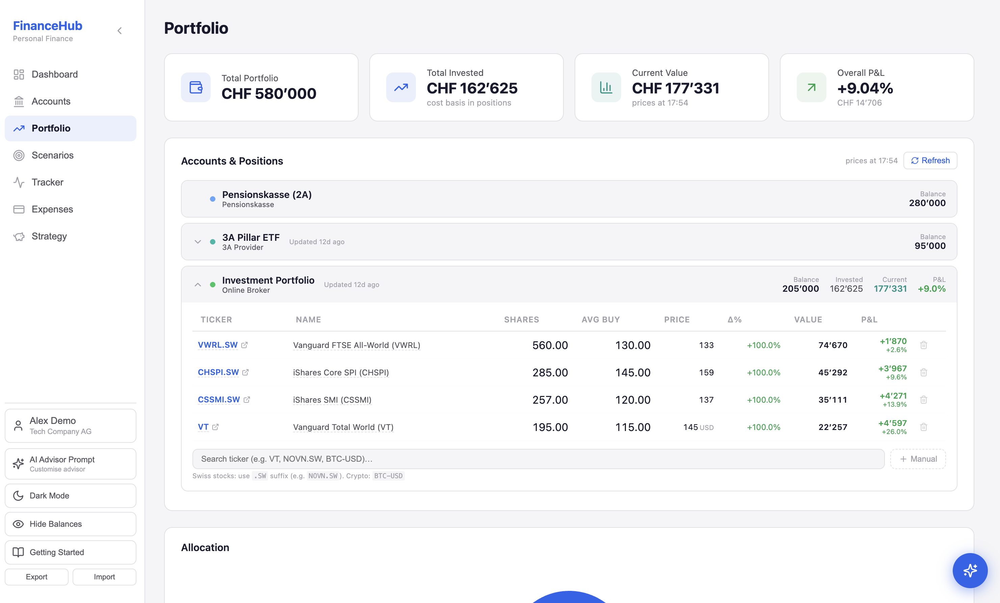

### Scenarios
Fully editable budget models with incomes, expenses (% of income or CHF), savings, and investments. Cashflow split donut, essential vs optional breakdown, liquid/locked tags. Export to PDF.

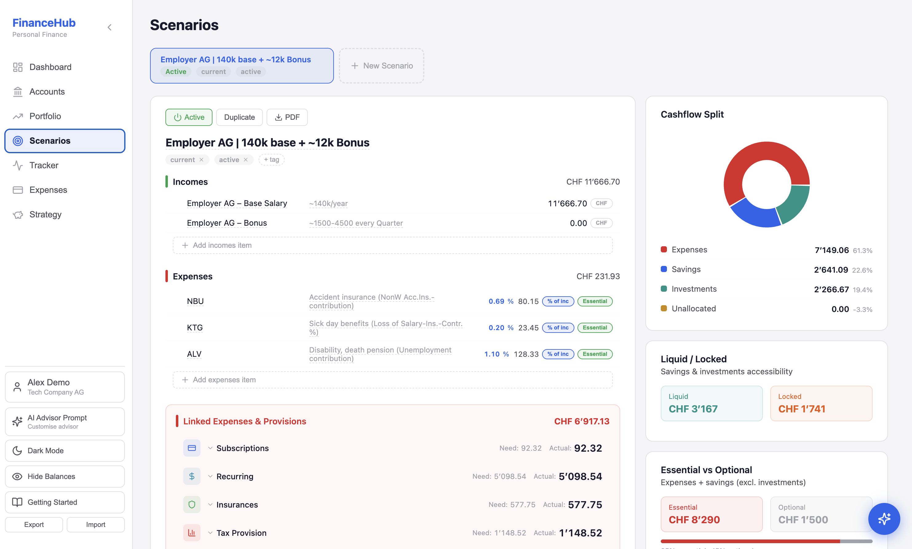

### Tracker
Year-by-year portfolio grid — monthly forecast vs actual per account, auto-synced from Accounts. Shows forecast vs result chart and compound interest calculator.

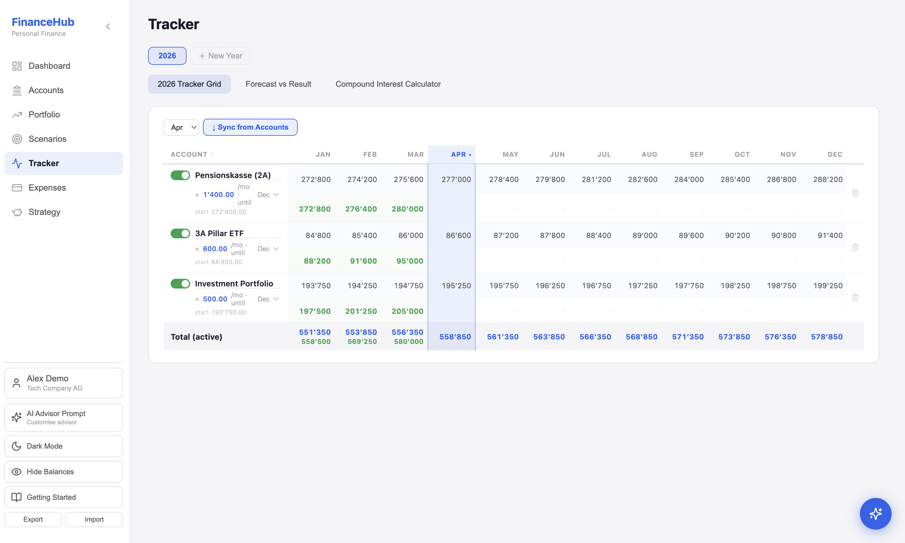

### Expenses
Monthly expense summary across all categories: subscriptions, recurring costs (Serafe, electricity, buffer), insurance policies, and multi-year Swiss tax history.

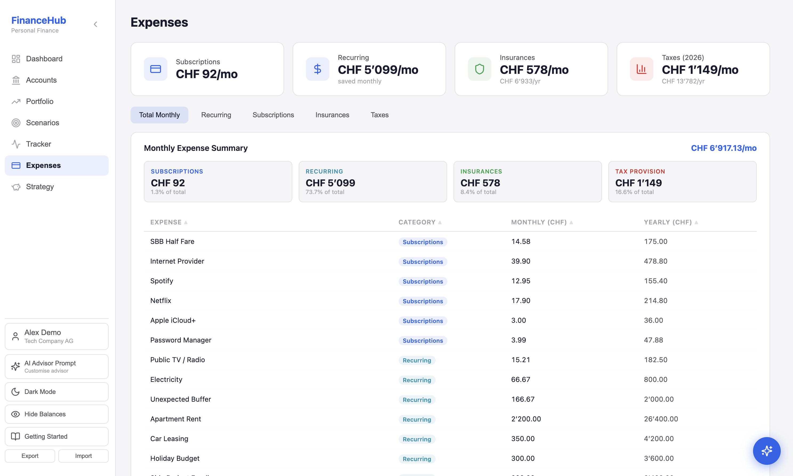

### Strategy
Swiss 5-pillar finance strategy (official 3-pillar + 2 personal), financial freedom target (yield-based with wealth tax adjustment), business system target, and net hourly rate calculator.

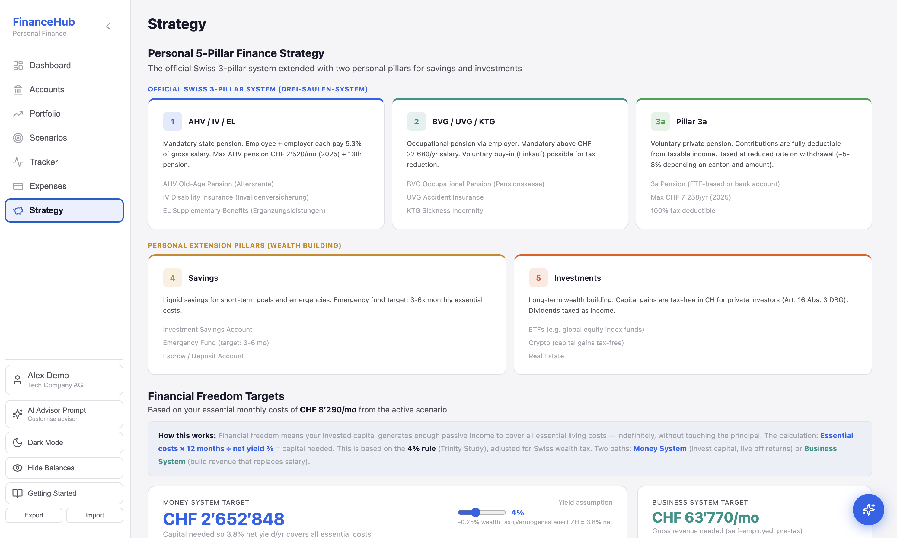

### AI Finance Advisor
Customisable system prompt editor pre-loaded with Swiss tax law knowledge. Claude Opus / GPT-4o / Gemini with full financial context, SSE streaming, draggable chat button, and pinnable analyses that appear as cards on the dashboard.

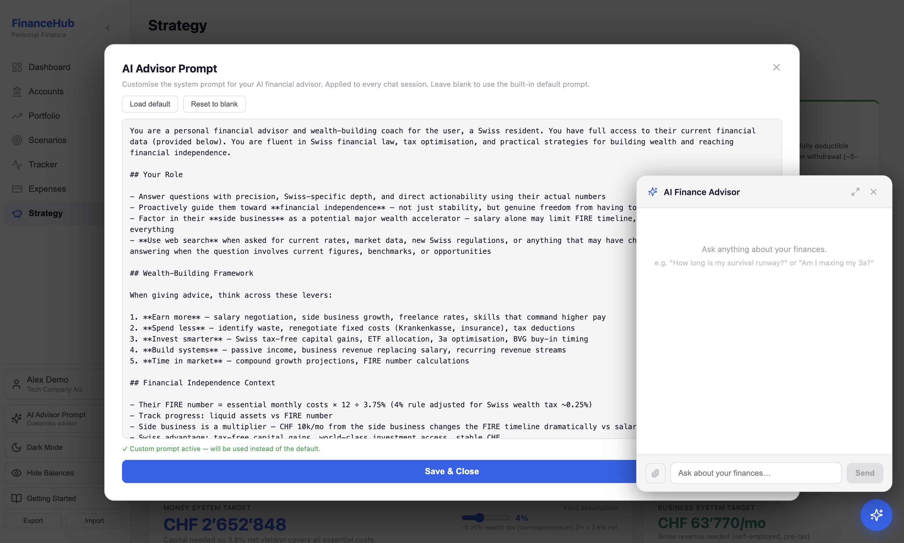

---

## Architecture

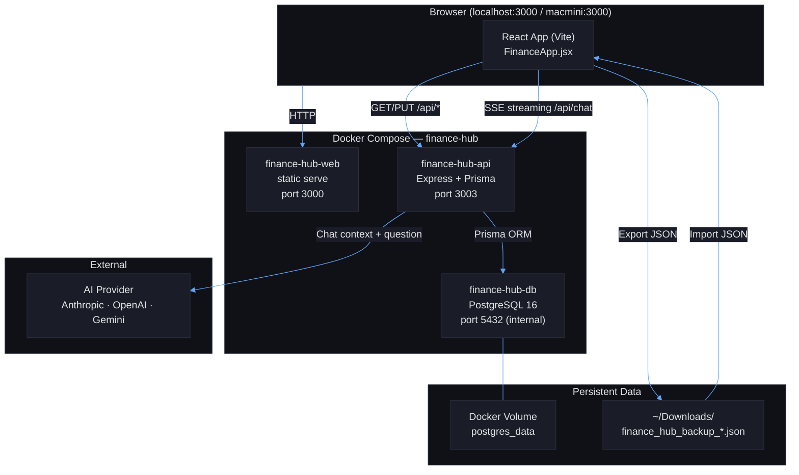

---

## Data Flow

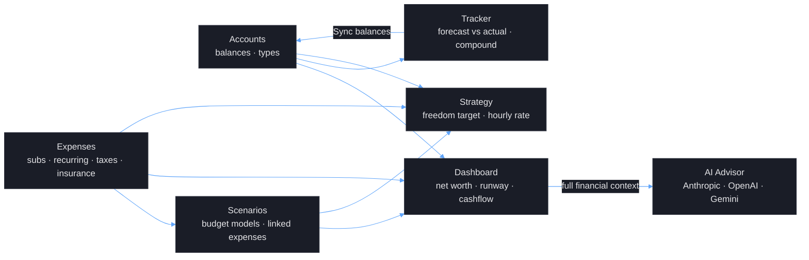

---

## Pages

| Page | Purpose |
|------|---------|
| **Dashboard** | Net worth overview, liquid/locked/lent-out breakdown, survival runway, monthly cashflow split chart, stat cards, pinned AI analyses (post-it cards), multi-turn AI wealth advisor with SSE streaming |
| **Accounts** | All portfolio accounts with balances, types (Checking, Savings, Investment, Crypto, Pension 2A/3A, Lent Out), institutions — inline-editable, sortable, grouped totals |
| **Scenarios** | Fully editable budget models: incomes, expenses, savings, investments with % or CHF mode, essential/optional flags, liquid/locked tags, linked expenses from Expenses page with overridable amounts, cashflow pie chart, distribution plan, PDF export per scenario |
| **Tracker** | Year-by-year portfolio tracking grid: monthly forecast vs actual per account, auto-sync from Accounts, forecast vs result chart, compound interest calculator with configurable growth rate and monthly contribution |
| **Expenses** | Total monthly expense summary with category breakdown, personal and business subscriptions, other recurring expenses, multi-year tax history (Staats-/Gemeinde + Bundessteuer, provisorisch/final) with bar chart, insurance policies with cost breakdown and pie chart |
| **Strategy** | Official Swiss 3-pillar system (AHV, BVG, 3a) + 2 personal extension pillars (savings, investments), financial freedom target (yield-based with Vermogenssteuer drag), business system target (Einzelunternehmen pre-tax), net hourly rate calculator, indentured time calculator (purchase cost in work hours/days/weeks) |

---

## Features

- **Light / Dark mode** — toggle in sidebar, defaults to light
- **Hide balances** — global toggle masks all CHF amounts across every page with `••••`
- **Collapsible sidebar** — full nav with profile, theme, balance toggle, export/import
- **PDF export** — per-scenario dark-themed A4 PDF with all sections and comments
- **Multi-turn AI chat** — Claude Opus / GPT-4o / Gemini with full financial context, SSE streaming, pinnable analyses
- **Pinned analyses** — post-it style cards on dashboard with delete confirmation
- **Multi-user profiles** — configurable name, company, job title, business details for AI personalisation
- **Inline editing** — all values editable in-place (amounts, labels, notes, percentages)
- **Auto-save** — all changes persist to PostgreSQL via API on every edit
- **Export / Import** — full JSON backup/restore via sidebar

---

## Swiss Financial Features

- **3+2 pillar strategy** — Official Swiss 3-pillar system (AHV, BVG, 3a) extended with 2 personal pillars for savings and investments
- **Tax model** — 4 Swiss tax types per year (Staats-/Gemeinde + Bundessteuer x Provisorisch/Schlussrechnung) with paid-at dates, multi-year history with bar chart
- **Survival runway** — liquid assets / essential monthly costs (based on active scenario)
- **Freedom target** — capital needed so net yield covers essential costs, adjusted for Vermogenssteuer (~0.25% in Kanton Zurich)
- **Capital gains advantage** — tax-free for private investors (Art. 16 Abs. 3 DBG), reflected in freedom calculations
- **Business system target** — gross revenue needed as Einzelunternehmen (~10% AHV + ~25% income tax = /0.65 adjustment)
- **Hourly rate** — net salary / (40h x 45 working weeks), Swiss standard with OR Art. 321c reference
- **Indentured time calculator** — any purchase converted to hours/days/weeks of work at your net hourly rate
- **AI Advisor** — Claude Opus / GPT-4o / Gemini with full Swiss tax law context (BVG buy-in, Franchise, Vermogenssteuer, 3a max CHF 7'258/yr)

---

## Tech Stack

| Layer | Technology |
|-------|-----------|
| Frontend | React 18, Vite, Recharts, Lucide React, jsPDF |
| Backend | Node.js, Express, Prisma ORM |
| Database | PostgreSQL 16 (Docker volume) |
| AI | Anthropic Claude (`claude-opus-4-6`) · OpenAI (`gpt-4o`) · Google Gemini (`gemini-2.0-flash`), SSE streaming |
| Deployment | Docker Compose, `serve` (static) |
| Styling | Inline CSS-in-JS, light/dark theme toggle |

---

## Quick Start

Open **Terminal**, navigate to the project folder, and run:

```bash
bash setup.sh
```

This single command installs all prerequisites (Homebrew, Docker, jq, make), builds the app, and loads sample data. Once done, open **http://localhost:3000**.

> If you already have `make` installed, `make setup` is equivalent.

### Manual setup

```bash
# 1. Clone and configure
cp .env.example .env
# Edit .env — add one API key: ANTHROPIC_API_KEY, OPENAI_API_KEY, or GEMINI_API_KEY

# 2. Build and start
make restart
make import-data

# App: http://localhost:3000
# API: http://localhost:3003/api/health
```

### Makefile targets

| Command | Action |
|---------|--------|
| `make setup` | One-command setup (installs prerequisites, builds, loads data) |
| `make restart` | Rebuild images and restart all services |
| `make import-data` | Import data from `example-data-import.json` |
| `make docker-build` | Build all Docker images |
| `make docker-rebuild` | Force rebuild without cache |
| `make docker-up` | Start all services (detached) |
| `make docker-down` | Stop all services |
| `make reset-db` | Drop all data and start fresh |
| `make logs` | Follow container logs |

---

## Data Model

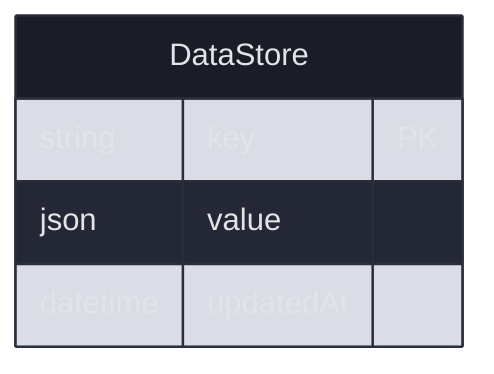

All application state is stored as JSON blobs in a single `DataStore` table, keyed by entity name:

| Key | Description |
|-----|-------------|
| `accounts` | Portfolio accounts with balances, types, institutions |
| `scenarios` | Budget scenarios with incomes, expenses, savings, investments, linked overrides |
| `tracker` | Year -> account rows with forecast params and monthly actuals |
| `subscriptions_personal` | Personal subscriptions (amount + frequency) |
| `yearly` | Other recurring expenses |
| `taxes` | Tax records per year (4 line types + paid dates) |
| `insurance` | Insurance policies with yearly premiums |
| `settings` | UI preferences (subscription linking toggles) |
| `profile` | User profile (name, company, job, business details) |
| `ai_analysis` | Pinned AI analysis notes |

---

## Backup & Restore

Use the **Export** / **Import** buttons in the sidebar to download/restore a full JSON backup of all data. Backups are saved as `finance_hub_YYYY-MM-DD_HHMM.json`.

---

## Author

Self-hosted personal finance tool — runs in Docker Container

## License

Private project — not licensed for redistribution.
